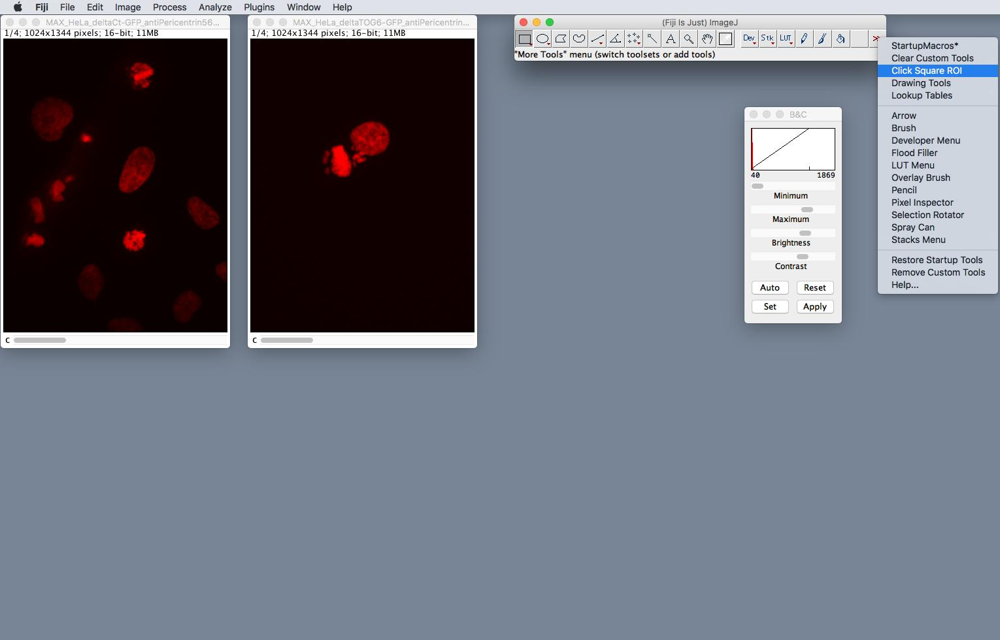
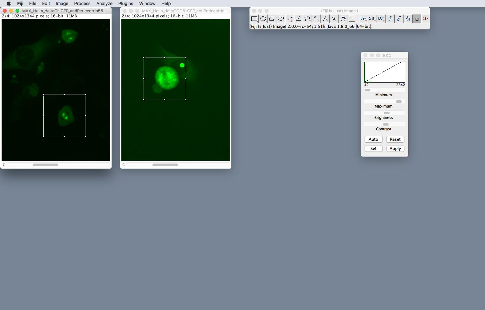
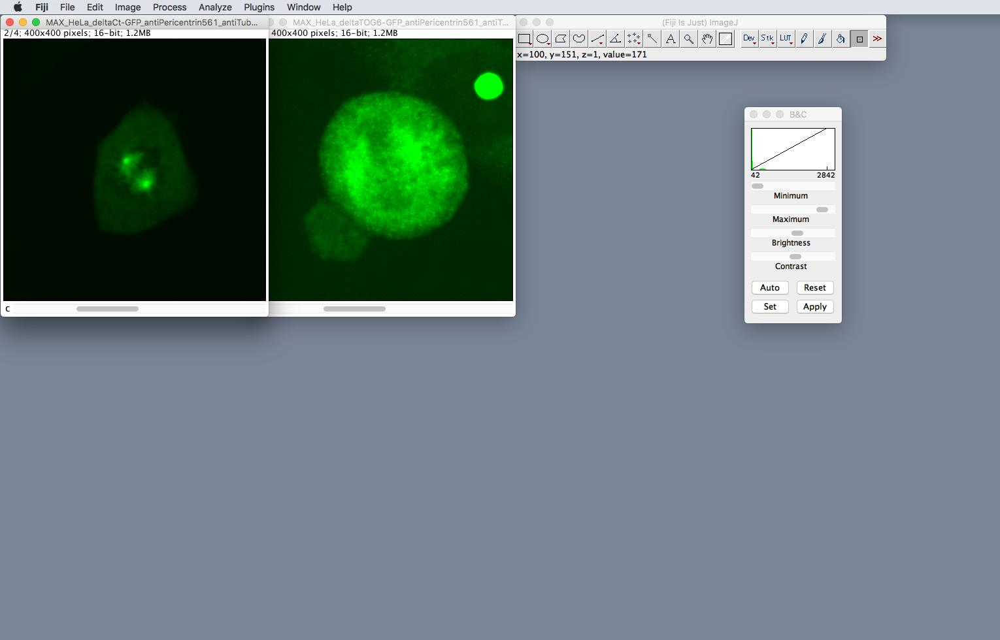
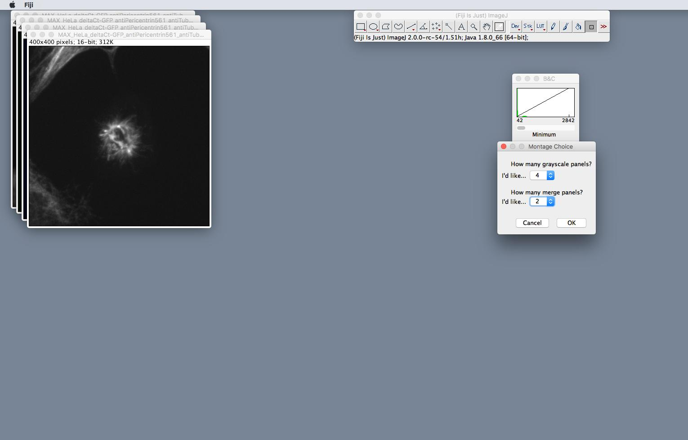
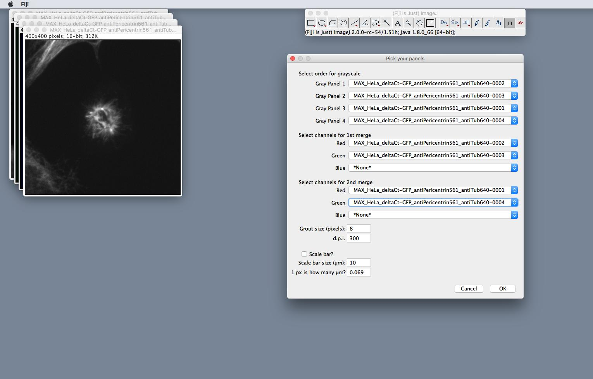
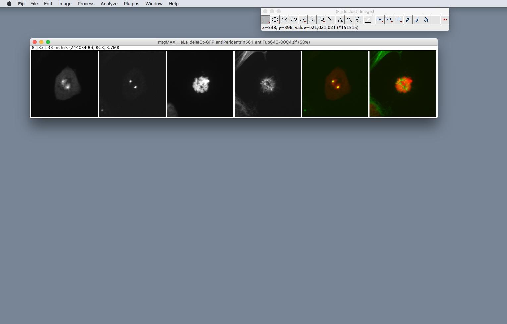
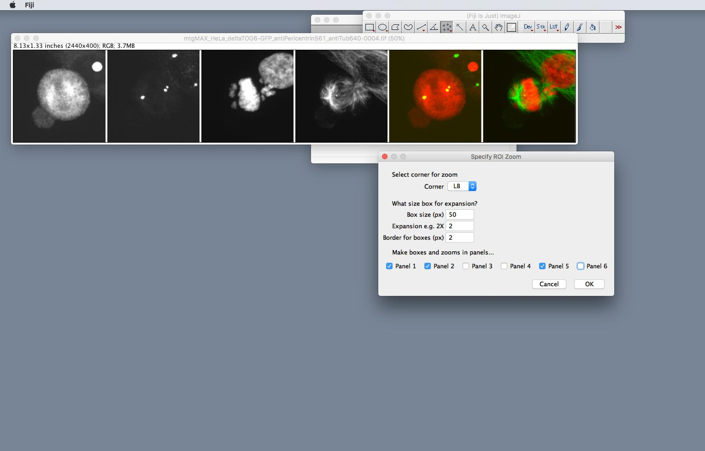
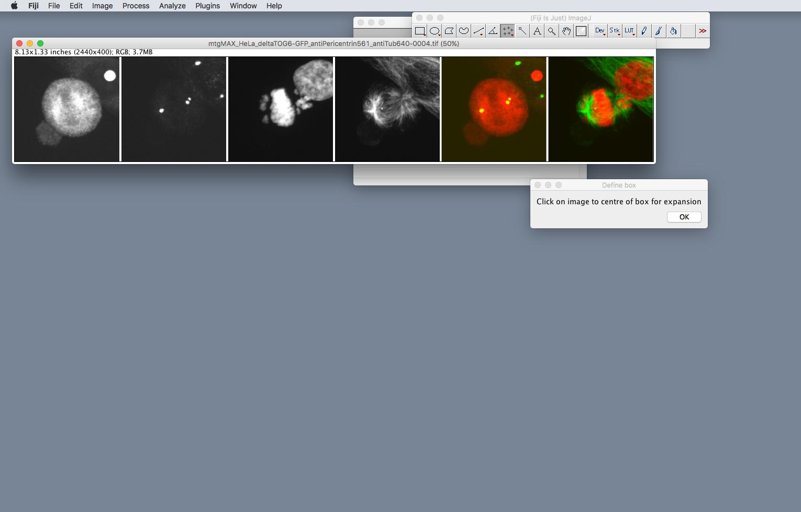
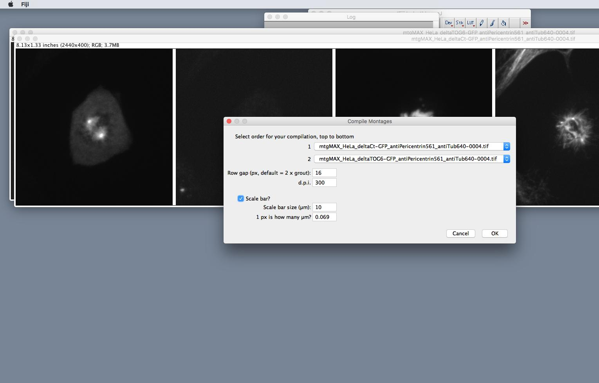
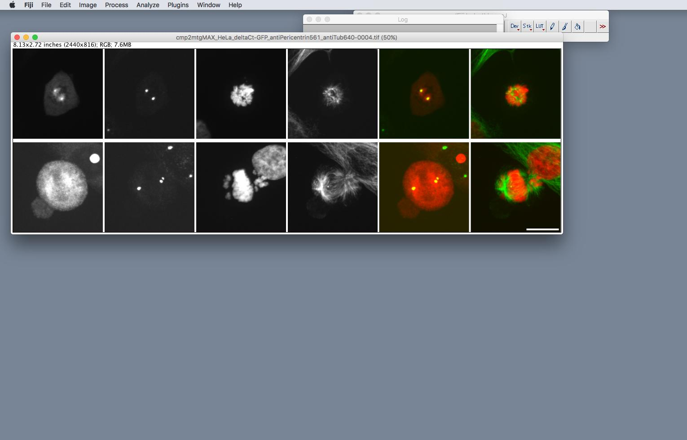

# imagej-macros
Some simple macros for Fiji/ImageJ that we are using in the lab. These tools are now available via the *quantixed* ImageJ [update site](http://sites.imagej.net/Quantixed/). Instructions for how to follow a 3rd party update site are [here](http://imagej.net/How_to_follow_a_3rd_party_update_site). This is the best way to install these macros and maintain the latest versions.

If you want to install manually, add the contents of `macros` and `scripts` to the corresponding directories in your Fiji/ImageJ installation.

After installation, all macros can be found under the menu item called **Lab Code**.

## Quick links

1. [Figure Maker](#figure-maker)
	1. Prepare your [images](#prepare-your-images)
	2. Make a [montage](#montage)
	3. Optional: add [ROI Zoom](#roi-zoom)
	4. [Compile](#put-the-rows-together) your montages
	4. [Columns](#i-want-columns-not-rows) not rows?
	5. [Figures the quantixed way](#figures-the-quantixed-way)
2. [Blind Analysis](#blind-analysis)
3. [ELN Saver](#eln-saver)
4. [Other Utilities](#other-utilities)
5. [Misc Macros](#misc-macros)

### Figure Maker

There are macros to help you to make figures with montages - made the way we like them! There are other plugins for making figures in ImageJ but none did what we [wanted](#figures-the-quantixed-way), so we made our own.

#### Prepare your images

Load in your multichannel image, adjust how you want and then crop.
To do this select *Click Square ROI* from the >> on the toolbar.

This tool gives 400 x 400 pixel square ROI, right click to get a different size.
Select the area you want.

Crop your images and save them as TIFFs.

#### Make a montage row

To make a nicely spaced montage (row of images). Select *Lab Code>Figure Maker>Montage Horizontal Flexible*

Note that there are other options here: to make a simple RGB montage (this is good for three channel images were you just want one merge panel, this also works on whole directories), there are [vertical montage](#i-want-columns-not-rows) options for flexible and RGB montages.

You are asked to pick your cropped TIFF.

You can specify the number of grayscale (channel) panels and choose the number of merge.

In the next dialog you can pick which panels go where in your montage.

Grout and scale bars can be added flexibly, no border is added. This is different to ImageJ's Make Montage and makes figure rows the [way we like them](figures-the-quantixed-way)! Note that if you are going to compile montages, it's best to add a single scale bar at this stage.

Your montage is saved in the same directory as the original image. The macro leaves it there, so that you can admire your awesome data!

#### Optional: add ROIs and zooms

Sometimes, we like to add a ROI and a zoomed version of this ROI to various panels in the montage. To do this open your montage and select *Lab Code>Figure Maker>ROI Zoom*

You can pick which corner you want the zoom and which panels you'd like to add an ROI and zoom.

After clicking OK, you are asked to select the centre of the ROI.

Note that this code will run on stacks as well so that you can add ROIs and zooms to movies!

#### Now put the rows together

Finally, if we have more than one montage, we need to compile them together. Load in all the montages you'd like to compile. Now select *Lab Code>Figure Maker>Compile Row Montages*

The dialog asks you to select which montage you'd like where.

Your compilation will save back in the same directory as the montages. Note, that you can always make one compilation and then add more montages or other compilations.

#### I want columns not rows

This is fine. Just select *Lab Code>Figure Maker>Montage Vertical Flexible* This will do the same thing but put the channels vertically with any merges at the bottom. Note that there is a version to make simple RGB montages. There is a vertical version of this too.

Remember that when you compile vertical montages, you need to select *Lab Code>Figure Maker>Compile Column Montages*

Note that **results from Figure Maker are saved as 300 ppi TIFF** ready for use in Illustrator or equivalent software.

#### Figures the quantixed way

For multichannel microscopy images, e.g. from an immunofluorescence experiment, *quantixed* follows these rules for best practice.

1. Individual channels as grayscale - reason: the eye does not detect black-to-red in the same way as black-to-green or black-to-blue
2. In a row montage the merge is on the right. In a column montage it is at the bottom
3. Square images, square ROIs and square zooms
4. No border
5. Scale bar in the bottom right corner
4. Fixed grout of 8 pixels (suggested)
6. Scale bar of 10 µm, height of 2 x grout (suggested)
7. Grouting between conditions is 2 x grout between channels (suggested)
8. Labelling is done in Illustrator or some other software to assemble the final figure, *not* in ImageJ

### Blind Analysis

`BlindAnalysis.ijm` Takes a directory of TIFFs, strips the label from them and saves them with a blinded name. A tsv called `log.txt` is created to log the association between the original file and the blinded copy. Works on TIFF only.

### ELN Saver

This is a simple utility to save a version of the file you are viewing in Fiji/ImageJ to put in your electronic lab notebook. A png version or low-res movie of the file you are looking at is saved to the Desktop with a unique name. A text file is saved to explain the filenames. 

--

### Other utilities

In `qUtils` there are some other utility macros that we use in the lab.

We've had problems with nd2 files being saved with a LUT that is not pure red, pure green or pure blue. This is because it uses a LUT that is based on absolute wavelengths of the fluorophore. You can use `Make_NIS_Pure_RGB.ijm` to sort out the colours.

Open all the nd2 files in a directory and save them as TIFF to another directory with `nd2SaveAsTiff.ijm`.

Maybe you like to open a whole directory of images, look through them, closing the bad ones and leaving the good ones open. Perhaps you want to grab the list of good images so that you can come back to it later? Well, `PrintTitlesOfNiceImages.ijm` does this for you.

--

### Misc Macros

Other macros that we use - but are not included in the update site - are found in the `misc` directory.