# imagej-macros

Some simple macros for Fiji/ImageJ that we are using in the lab.

Most of these tools are available via the *quantixed* ImageJ [update site](http://sites.imagej.net/Quantixed/). Instructions for how to follow a 3rd party update site are [here](http://imagej.net/How_to_follow_a_3rd_party_update_site). This is the best way to install these macros and maintain the latest versions.

If you want to install manually, add the contents of `macros` and `scripts` to the corresponding directories in your Fiji/ImageJ installation.

After installation, all macros can be found under the menu item called **LabCode**.

## Quick links

1. [Figure Maker](#figure-maker)
	1. Prepare your [images](#prepare-your-images)
	2. Make a [montage](#montage)
	3. Optional: add [ROI Zoom](#roi-zoom)
	4. [Compile](#put-the-rows-together) your montages
	5. [Figures the quantixed way](#figures-the-quantixed-way)
2. [Blind Analysis](#blind-analysis)
3. [ELN Saver](#eln-saver)
4. [Other Utilities](#other-utilities)
5. [Misc Macros](#misc-macros)
6. [I'm getting errors](#troubleshooting)


### Figure Maker

There are macros to help you to make figures with montages - made the way we like them! There are other plugins for making figures in ImageJ but none did what we [wanted](#figures-the-quantixed-way), so we made our own.

There is a video explaining how to use the Figure Maker [here](https://www.youtube.com/watch?v=6qORVjkCm90).


#### Prepare your images

Load in your multichannel image, adjust how you want and then crop to a square.
To do this select *Click Square ROI* from the >> on the toolbar.

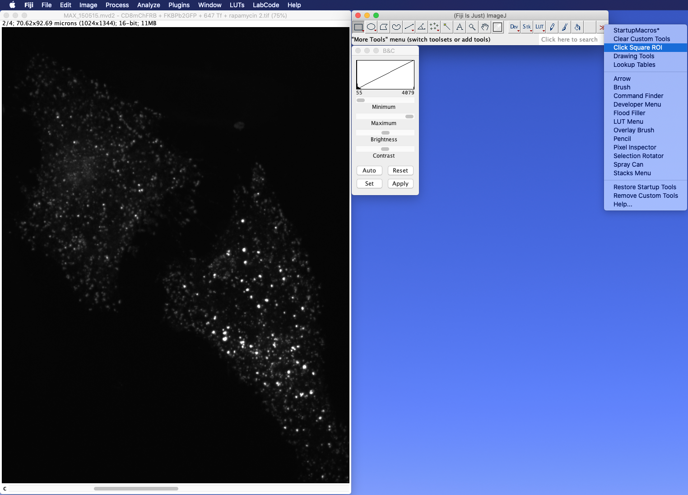

This tool gives 400 x 400 pixel square ROI, right click to get a different size.
Select the area you want.

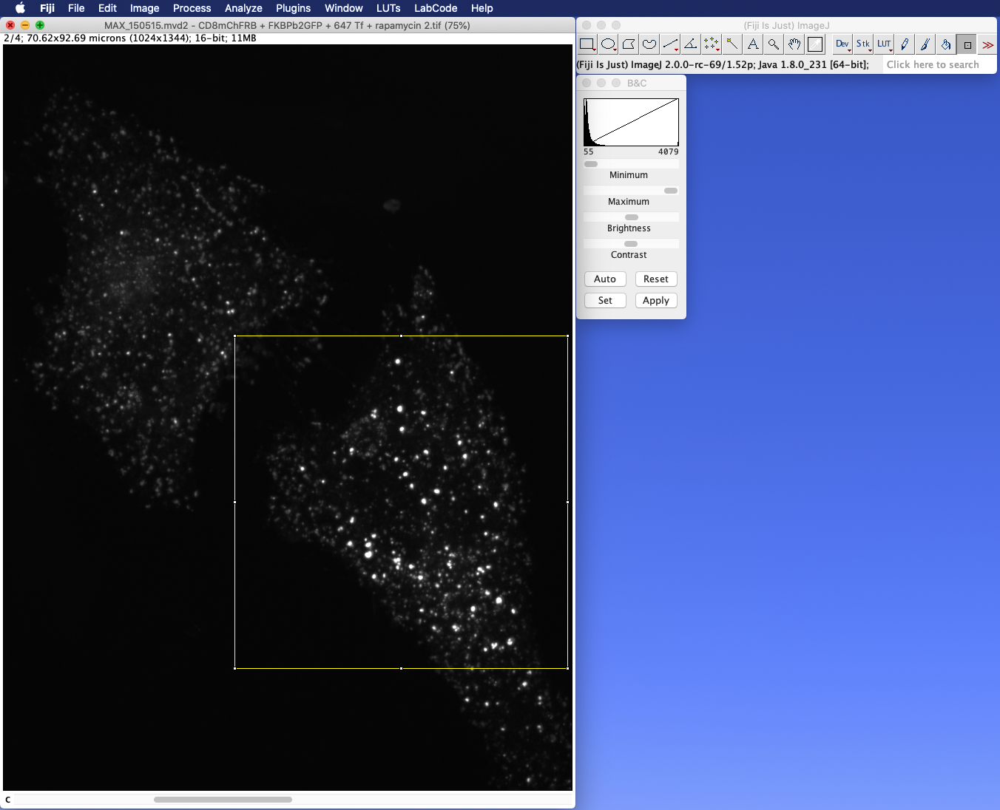

Crop your images and save them as TIFFs.

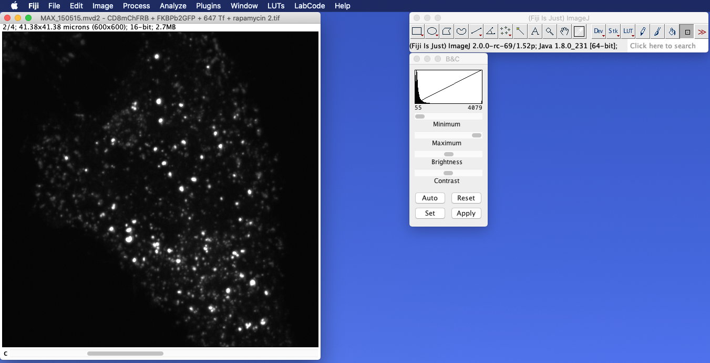


#### Make a montage

To make a nicely spaced montage (row of images). Select *LabCode > Figure Maker > Make Montage*

You are asked to pick your cropped TIFF.

You can specify the number of grayscale (channel) panels and choose the number of merges.

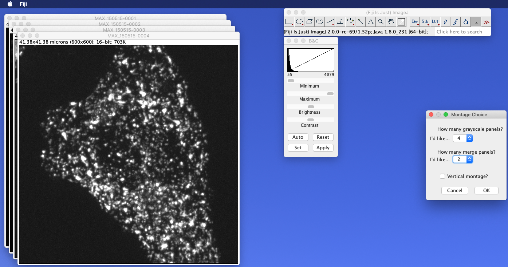

In the next dialog you can pick which panels go where in your montage and how to merge channels using which colours.

You can also specify a vertical (column) montage rather than horizontal (row).

Grout and scale bars can be added flexibly, no border is added. This is different to ImageJ's Make Montage and makes figure rows the [way we like them](figures-the-quantixed-way)! Note that if you are going to compile montages, it's best to add a scale bar at this stage to just one of the images.

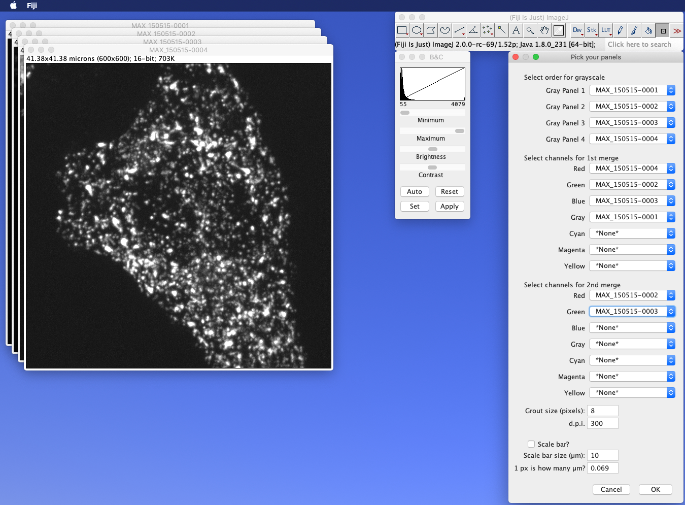

Your montage is saved in the same directory as the original image. The macro leaves it displayed, so that you can admire your awesome data!

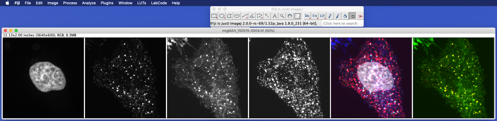

#### Multiple montages

If you want to make many montages, then select *LabCode > Figure Maker > Make Montage Directory*. This macro allows the user to make montages from all TIFFs in a directory. A dialog is shown at the start that allows the user to select which channels go where and then the montages are made in batch mode.

#### Movie/Stack montages

It is now possible to make a montage of movies or stacks. Select *LabCode > Figure Maker > Make Montage* and point the dialog at the file you'd like to montage.

If the image is a movie, or a z-stack (but not both) comprising more than one channel, then you will be able to generate a movie/stack montage.

#### Optional: add ROIs and zooms

Sometimes, we like to add a ROI and a zoomed version of this ROI to various panels in the montage. To do this open your montage and select *LabCode > Figure Maker > ROI Zoom*

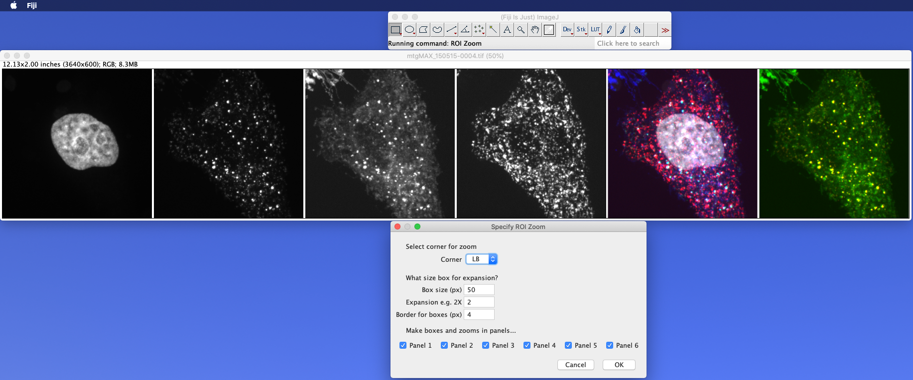

You can pick which corner you want the zoom and which panels you'd like to add an ROI and zoom.

After clicking OK, you are asked to select the *centre* of the ROI.

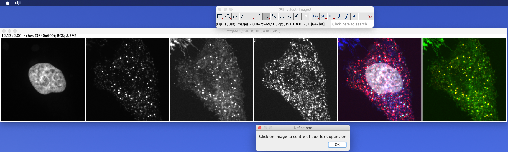

The resulting image is saved in the same directory as the montage.

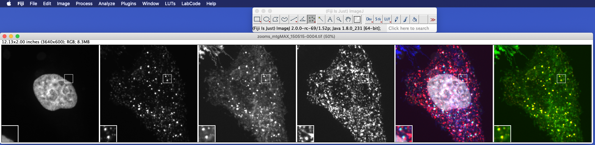

Note that this code will run on stacks as well so that you can add ROIs and zooms to movies!

It only works on square images and montages made from squares. If your zooms are in the wrong place, check the size(s) of your input images.

When the ROI-Zoom version is made, a text file is saved in the same directory as the resulting image. It contains useful information that you can use to recreate the image if you need to.

Alternatively, you might prefer to highlight the ROI but not insert the zoomed ROI.
In this case, **Make ROI Zoom External** will allow you to save the zoomed ROI as a separate panel.
If you'd like to place the zoomed ROI as a further panel, select 0 to zoom the ROI so that it is the same size as a regular panel; otherwise, pick the magnification you'd prefer.

#### Optional: invert panels or use non-standard LUTs

The grayscale panels might look better inverted so that they are black-on-white, rather than white-on black.
This can be helpful for dim or small features.
To do this, open the montage that you would like to invert and select ***Invert Montage***.
This will launch a dialog to help you to choose which panels you'd like to invert and whether you would like to outline the panels with a black border.
It's best to do this after you have made the ROI zooms if you want to.
There's also an "auto" mode, that will invert all panels except the right/bottom panel (contains the merge) to speed things up.

If you'd like to switch an RGB merge panel for the OPF colour scheme, open the montages you'd like to change and select **Change Montage Merge**.
This command simply switches Red-Orange, Green-Fresh and Blue-Purple for a slightly different look.
To run this, you must have _NeuroCytoLUTs_ Update Site installed.

#### Now put the rows together

Finally, if we have more than one montage, we need to compile them together. Load in all the montages you'd like to compile. Now select *LabCode > Figure Maker > Montage Compiler*

The dialog asks you to select which montage you'd like where.

The routine is intelligent enough to recognise vertical and horizontal montages and to compile them left-to-right or top-to-bottom as appropriate.

Again, a text file is saved with the resulting compilation image so that you know which images went where.

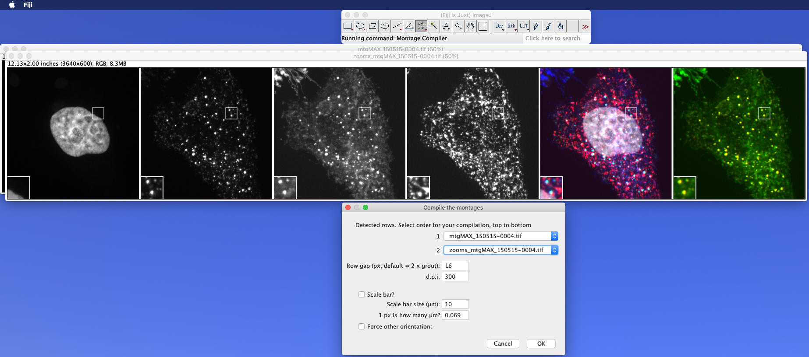

Your compilation will save back in the same directory as the montages. Note that you can use this macro to make one compilation and then use it again to add more montages (extra rows) or other compilations. Very large compilation can be built this way.

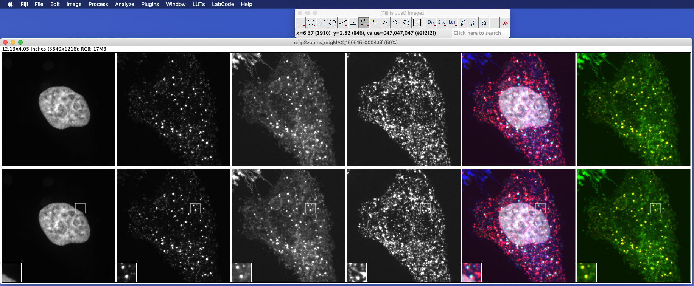

Note that **results from Figure Maker are saved as a flat 300 ppi RGB TIFF** ready for use in Illustrator or equivalent software.

Important note about scale bars. The code suggests a pixel size for use in the scale bar. If the scaling of your images is incorrect, then the scale bar will be the wrong size. **If the dialog box says 0.069, double-check your original image for scaling information**, 0.069 is the "pixel size" for a 300 ppi image, i.e. the scaling no longer relates to the original image. Bottom line is: **make sure you know the pixel size of your images before adding any scale bars.**

#### Figures the quantixed way

For multichannel microscopy images, e.g. from an immunofluorescence experiment, *quantixed* follows these rules for best practice.

1. Individual channels as grayscale - reason: the eye does not detect black-to-red in the same way as black-to-green or black-to-blue
2. In a row montage the merge is on the right. In a column montage it is at the bottom
3. Square images, square ROIs and square zooms
4. No border
5. Scale bar in the bottom right corner
4. Fixed grout of 8 pixels (suggested)
6. Scale bar of 10 µm, height of 2 x grout (suggested)
7. Grouting between conditions is 2 x grout between channels (suggested)
8. Labelling is done in Illustrator or some other software to assemble the final figure, *not* in ImageJ

### Figure Utilities

Check whether your figure or image is colour blind safe using this simple utility `Check_Colour_blindess.ijm`.

### Blind Analysis

`BlindAnalysis.ijm` Takes a directory of TIFFs, strips the label from them and saves them with a blinded name. A tsv called `log.txt` is created to log the association between the original file and the blinded copy. Works on TIFF only.


### ELN Saver

This is a simple utility to save a version of the file you are viewing in Fiji/ImageJ to put in your electronic lab notebook. A png version or low-res movie of the file you are looking at is saved to the Desktop with a unique name. A text file is saved to explain the filenames. 

### Movie Annotation

Two macros that will:

1. Add arrows to movies to highlight and track an object of interest. Unlike other scripts out there, this one places an arrowhead in a fixed orientation/distance from the object and allows annotations in any frame (not _all_ frames).
2. Irregular Time Stamps - adds timestamps to movies, formatting them in hh:mm or mm:ss. Unlike other versions, negative times are allowed and the time intervals do not have to be regular. Requires a new line separated text file of times.

--

### Other utilities

In `qUtils` there are some other utility macros that we use in the lab.

We've had problems with nd2 files being saved with a LUT that is not pure red, pure green or pure blue. This is because it uses a LUT that is based on absolute wavelengths of the fluorophore. You can use `Make_NIS_Pure_RGB.ijm` to sort out the colours.

Open all the nd2 files in a directory and save them as TIFF to another directory with `nd2SaveAsTiff.ijm`.

Maybe you like to open a whole directory of images, look through them, closing the bad ones and leaving the good ones open. Perhaps you want to grab the list of good images so that you can come back to it later? Well, `PrintTitlesOfNiceImages.ijm` does this for you.

--

### Misc Macros

Other macros that we use - but are not included in the update site - are found in the `misc` directory.

--

### Troubleshooting

Most problems are solved by allowing Fiji's updater to install the latest code from the *quantixed* ImageJ Update Site.

**Still not working?** All routines use a number of custom functions which get loaded when Fiji starts up. Errors in running these routines usually traceback to third party code that modifies `StartupMacros.fiji.ijm`. Which can be found in the `macros` directory. Specifically, if the third party has deleted this code block, then none of the autorun functions happen at startup.

```// The macro named "AutoRun" runs when ImageJ starts.

macro "AutoRun" {
	// run all the .ijm scripts provided in macros/AutoRun/
	autoRunDirectory = getDirectory("imagej") + "/macros/AutoRun/";
	if (File.isDirectory(autoRunDirectory)) {
		list = getFileList(autoRunDirectory);
		// make sure startup order is consistent
		Array.sort(list);
		for (i = 0; i < list.length; i++) {
			if (endsWith(list[i], ".ijm")) {
				runMacro(autoRunDirectory + list[i]);
			}
		}
	}
}
```

If you can't bear to uninstall the third-party code (or don't know which update site causes the problem), just paste that code block into `StatupMacros.fiji.ijm` and things will start to work again.

**Other notes** Note that usage of RGB images has a limitation of a filename length of 59 characters.
